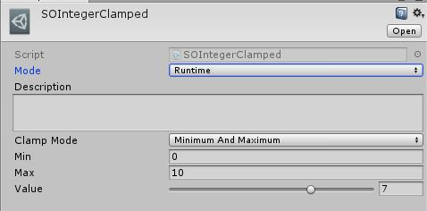
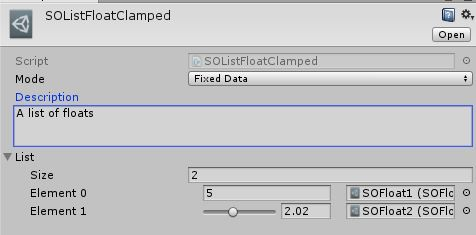

# ScriptableObjects Oriented

Provide tools for an Unity architecture based on ScriptableObjects (SO). 
The philosophy of this plugin is based on that [conference](https://www.youtube.com/watch?v=raQ3iHhE_Kk).

## Create a SO Event
A SO Event is a ScriptableObject that can raise event. 
Since the event is an asset with a static number of parameter, you will probably create a lot of SO event asset.

Create a SO Event from scratch just to change the type of parameter or add new one of your event can be redundant and time-consuming, a little wizard is provided to help you.

- Assets -> Create -> SO -> Create -> Event
- The wizard will appear
- Set the event name. It will define the class name.
- [Optional] Set the category name. It will define its location in the "Create" asset menu.
- [Optional] Set the number of parameters
- Set the parameter name
- Set the parameter type name OR use the preset box to select common types so you don't have to write it.
- Click "Create" when you are done
- Let Unity compile and you should now be able to create a new event from *Assets -> Create -> SO -> [Your Category] -> [Your Event Name]*

You can add more types with the settings.

## Settings
The settings allow to improve the SO Event Wizard. 
Start by creating a new one.
- Assets -> Create -> SO -> Create -> Settings
- Add additional types
- Open the SO Event Wizard and link the settings
- Your new types are now available among the presets

### Using SO Events

Just declare your SO Event in your class, as it is a standard C# class. 
You can dynamically add listener, remove listener and raise event, like in any standard event system. 
However, now you can select the SO Event in the *Project* tab and you will see that you have additional informations. 
All these data are editor-only so no overhead in your final build. 
You can :
- Add a description : you can give extra datas to explain where it should be called.
- Set some parameters : these parameters will be used when you click on **Raise**
- Raise the event : it will trigger the event using the above parameters
Raising the event is really useful to manually test isolated system.

### SOEventMode Attribute

You can add a `SOEventMode` attribute on your event field to explicitly tell to the world if your event will be a listener or a broadcaster. 
It will allow you to be more explicit on the use of an event, visible from the Unity Inspector, next to the event field.
- Broadcaster : 
- Listener : 

Examples :

`[SOEventMode(SOEventActionMode.Broadcaster)]` 
`public SOMyEvent eventBroadcaster;`

`[SOEventMode(SOEventActionMode.Listener)]` 
`public SOMyEvent eventListener;`

## Atomics

Multiple basic types are available when the plugin is installed. These one are called "Atomics" as they are really small sized data. 
They are available from the *Assets -> Create -> SO -> Create -> Atomics* menu. 

Are supported :
- SO Bool
- SO Integer
- SO Float
- SO String
- SO Vector2
- SO Vector3
- SO Quaternion (not editable via Euler angles yet)
- SO Integer Clamped : an integer that can be clamped by minimum, maximum or both. If both is selected, a slider will be available.
- SO Float Clamped : a float that can be clamped by minimum, maximum or both. If both is selected, a slider will be available.

## Containers

Containers are available from the *Assets -> Create -> SO -> Create -> Containers* menu. 
Use the wizard to create your custom container types. Once it is done, you will be able to create new ScriptableObject from it. 

Are supported :
- SO List : it is the equivalent of a simple List

